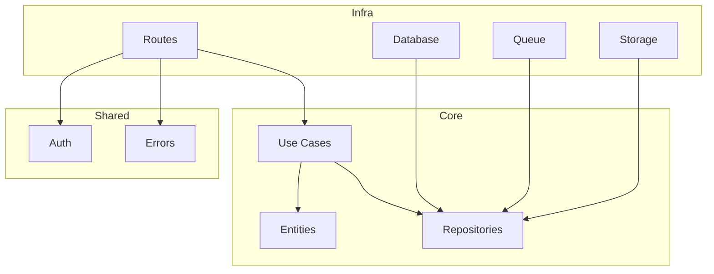

# API de Transcrição de Áudio e Vídeo

## Resumo do Projeto

Esta é uma API REST construída com [ElysiaJS](https://elysiajs.com/) e [Bun](https://bun.sh/), utilizando [Drizzle ORM](https://orm.drizzle.team/) para acesso a um banco de dados PostgreSQL. A API fornece endpoints para autenticação de usuários, gerenciamento de squads, transcrição de arquivos de áudio e vídeo, e categorização de conteúdo.

## Arquitetura

O projeto segue os princípios da **Clean Architecture**, separando as responsabilidades em três camadas principais: `core`, `infra`, e `shared`.



### Estrutura de Pastas

A estrutura de pastas reflete a separação de responsabilidades da Clean Architecture:

```
/
├── src/
│   ├── core/
│   │   ├── entities/
│   │   ├── repositories/
│   │   └── use-cases/
│   ├── infra/
│   │   ├── config/
│   │   ├── database/
│   │   ├── queue/
│   │   ├── repositories/
│   │   ├── routes/
│   │   └── storage/
│   └── shared/
│       ├── auth/
│       └── errors/
└── ...
```

- **`core`**: Contém a lógica de negócio da aplicação, incluindo entidades, interfaces de repositórios e casos de uso.
- **`infra`**: Contém o código de infraestrutura, como a configuração do banco de dados, implementações de repositórios e rotas da API.
- **`shared`**: Contém código compartilhado que pode ser usado em diferentes partes da aplicação, como middlewares de autenticação e tratamento de erros.

## Principais Endpoints

### Autenticação

- **`POST /auth/register`**: Registra um novo usuário.
- **`POST /auth/login`**: Autentica um usuário e retorna um token de acesso.

### Squads

- **`GET /squads`**: Lista todos os squads.
- **`GET /squads/:id`**: Obtém os detalhes de um squad.
- **`POST /squads`**: Cria um novo squad.
- **`PUT /squads/:id`**: Atualiza um squad.
- **`DELETE /squads/:id`**: Deleta um squad.
- **`POST /squads/:id/members`**: Adiciona membros a um squad.
- **`DELETE /squads/:id/members/:userId`**: Remove um membro de um squad.

### Transcrição

- **`POST /upload-files/:squadId`**: Envia arquivos de áudio/vídeo para transcrição.

### Categorias

- **`GET /categories`**: Lista todas as categorias de um squad.
- **`POST /categories`**: Cria uma nova categoria.
- **`PUT /categories/:id`**: Atualiza uma categoria.
- **`DELETE /categories/:id`**: Deleta uma categoria.

### Webhooks

- **`POST /webhooks/transcription-processed`**: Webhook para receber o resultado do processamento da transcrição.
